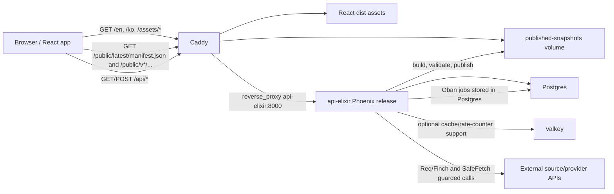
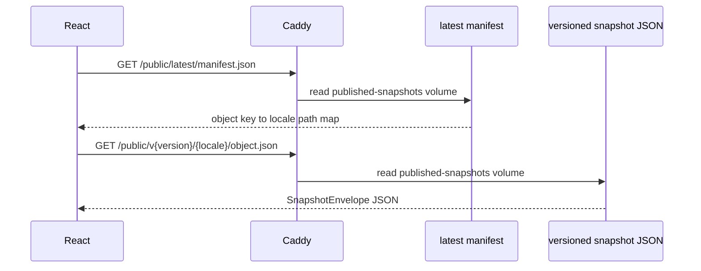
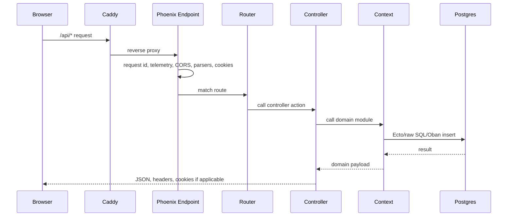
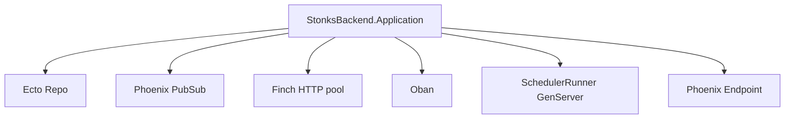
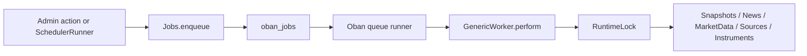
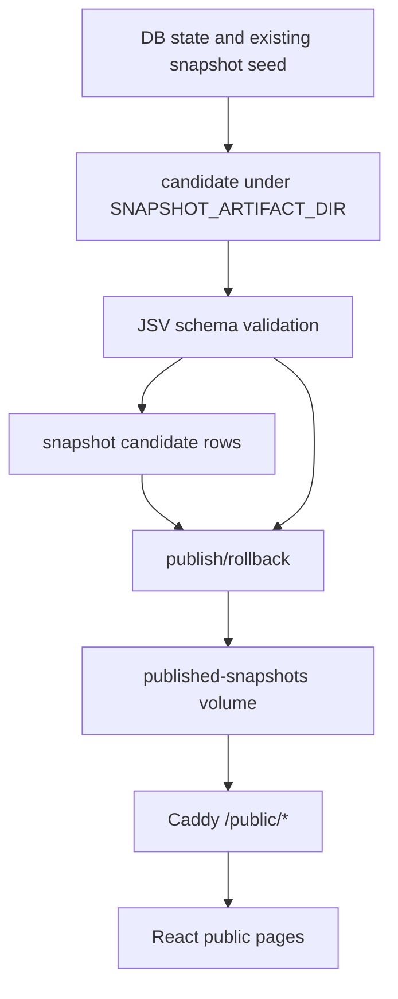
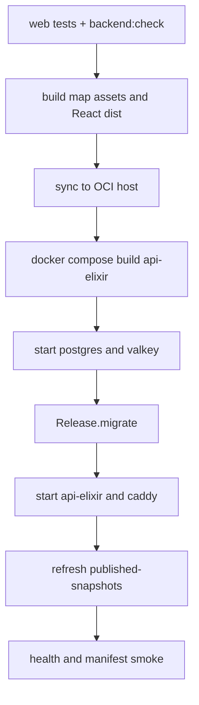

# Architecture

Stonks Radar is a snapshot-first React application with a Phoenix/Ecto/Oban
backend. The production backend runtime is the Elixir service `api-elixir`,
which owns API handling, background jobs, snapshot publication, and guarded
source fetching.

The main rule is:

- public readers use immutable JSON snapshots served by Caddy;
- admin, ingestion, jobs, source review, auth, and publication use Phoenix APIs;
- Postgres is canonical state;
- Oban is the durable job executor;
- Caddy is the public edge for React assets, snapshots, and `/api/*` proxying.

## Runtime Topology



Production Compose runs:

- `postgres`
- `valkey`
- `api-elixir`
- `caddy`

The optional `web` image is build/profile support, not the public runtime
backend. Production Caddy is the only service exposing host ports `80/443`.
Postgres, Valkey, and Phoenix stay on the internal Docker network.

## Public Snapshot Read Path

Anonymous public pages are snapshot-first. The browser loads:

- `/public/latest/manifest.json`
- `/public/v{version}/{locale}/home.json`
- object snapshots for map, news, calendar, countries/regions, sectors,
  scenarios, source status, funds, tickers, shorts, legal/corrections, and
  other public surfaces

Phoenix does not own `/public/latest/manifest.json`. Caddy serves it from the
mounted `published-snapshots` volume with `Cache-Control: no-cache,
max-age=0, must-revalidate`. Other `/public/*` snapshot files use short public
cache headers.



The frontend snapshot loader lives in `apps/web/src/lib/snapshots.ts`. It always
uses the manifest first, then fetches the locale-specific object path from
`manifest.objects`.

## Phoenix API Surface

Phoenix owns `/api/*` through `apps/backend_elixir/lib/stonks_backend_web`.

Route families:

- `/api/public/*`: health, status, provider status, market history, search,
  filings, transactions, insiders, disclosure summaries, and the manifest proxy
  diagnostic.
- `/api/auth/*`: password login, logout, current user, Google OAuth
  config/start/callback.
- `/api/admin/*`: authenticated admin dashboard, providers, sources,
  instruments, ingestion, review, jobs, snapshots, corrections, audit log, and
  local build helpers.
- `/api/instruments/*`: public instrument search/resolve/detail/review
  requests.
- `/api/internal/news/email-alerts`: signed internal email-alert ingestion.

The Phoenix request flow is:



Security and compatibility contracts are tracked in
`docs/elixir-backend-compatibility-matrix.md`.

## Elixir Backend Structure

The Phoenix application is `:stonks_backend`.

Important runtime files:

- `apps/backend_elixir/mix.exs`: Mix project, dependencies, test aliases, release
  definition.
- `apps/backend_elixir/lib/stonks_backend/application.ex`: OTP supervision tree.
- `apps/backend_elixir/config/runtime.exs`: environment-driven runtime config.
- `apps/backend_elixir/lib/stonks_backend_web/endpoint.ex`: Phoenix endpoint and
  plugs.
- `apps/backend_elixir/lib/stonks_backend_web/router.ex`: HTTP route table.
- `apps/backend_elixir/lib/stonks_backend_web/controllers/`: HTTP controllers.
- `apps/backend_elixir/lib/stonks_backend/`: contexts and runtime modules.

The OTP supervision tree starts:

- `StonksBackend.Repo`
- `Phoenix.PubSub`
- `Finch`
- `Oban`
- `StonksBackend.Jobs.SchedulerRunner`
- `StonksBackendWeb.Endpoint`



## Data Model And Persistence

Postgres is canonical. The Elixir backend preserves the existing domain schema instead
of redesigning tables in v1. For that reason, many contexts use
`StonksBackend.Sql`, a small raw-SQL wrapper over `Ecto.Adapters.SQL`, rather
than full Ecto schemas for every table.

This is intentional:

- keep the public/admin API contracts stable;
- keep the existing domain tables stable;
- minimize runtime risk;
- allow gradual Ecto schema extraction later where it improves maintainability.

Elixir-owned runtime additions include:

- Oban tables;
- `job_runtime_lock` for provider/source/global runtime locks;
- preserved auth/session/OAuth tables used by Phoenix.

Release migrations run through:

```bash
/app/bin/stonks_backend eval "StonksBackend.Release.migrate()"
```

## Auth, Cookies, And Admin Security

Auth is owned by `StonksBackend.Accounts` and `AuthController`.

The preserved auth surface is:

- `frw_session` cookie;
- `frw_csrf` short-lived cookie for OAuth handoff;
- `x-csrf-token` header for admin mutations;
- 12-hour sessions;
- roles: `owner`, `admin`, `editor`, `viewer`;
- TOTP support for privileged accounts;
- Google OAuth admin login;
- idempotent bootstrap admin support.

Password login verifies the user, password hash, and TOTP when required, writes
an `app_session`, sets the session cookie, and returns a JSON `csrf_token`.
Admin mutation routes require both a valid session role and CSRF token.

Google OAuth start/callback uses `oauth_login_state` for state and nonce
tracking. Callback success creates or updates a Google-backed admin user,
records audit rows, and sets the same session surface.

## Oban Jobs And Scheduler

Oban is the durable job executor. Legacy `job_queue` rows
are read-only migration/audit history and can be replayed into Oban using the
`legacy:<uuid>` namespace.

External job IDs are namespaced:

- `oban:<id>`
- `legacy:<uuid>`

Job dispatch is centered in:

- `StonksBackend.Jobs`
- `StonksBackend.Jobs.Workers.GenericWorker`
- `StonksBackend.Jobs.Scheduler`
- `StonksBackend.Jobs.SchedulerRunner`
- `StonksBackend.Jobs.RuntimeLock`
- `StonksBackend.Jobs.LegacyQueue`



Queue routing is based on job type:

- snapshots: `snapshot_*`, `news.publish_snapshots`
- news: `news.*`
- market data: `market_data.*`
- instruments: instrument search/index refresh
- disclosures: disclosure jobs
- maintenance/default: everything else

`job_runtime_lock` enforces provider, source, and global running limits. Snapshot
publication uses a global `snapshots` lock so candidate/publish operations do
not collide.

`SchedulerRunner` is a supervised GenServer. It wakes up on a configured tick,
asks `Jobs.Scheduler` which jobs are due, enqueues those jobs into Oban, then
schedules the next tick.

## Snapshot Build And Publication

Snapshot logic is owned by `StonksBackend.Snapshots`.

The Elixir backend can:

- build candidate snapshot trees;
- validate them with JSV against `packages/schemas/snapshots`;
- record candidate metadata in Postgres;
- publish a validated version to the `published-snapshots` Docker volume;
- rollback by republishing an earlier validated version;
- guard against prohibited fields such as API keys, raw HTML, prompts, private
  notes, and full article text.



Public snapshot byte-for-byte equality is not the goal; semantic path/schema/
cache parity is the goal. The manifest path remains stable.

## Watched Regions And Map Coverage

Watched countries/regions are centralized in:

```text
packages/shared-config/watched-regions.json
```

Both runtimes consume it:

- Elixir: `StonksBackend.WatchedRegions`
- TypeScript: `apps/web/src/lib/watchedRegions.ts`

The registry controls:

- news gathering;
- map rendering;
- region/country nav visibility;
- GDELT query terms;
- Natural Earth map names;
- GDP/top-economy grouping;
- priority and coverage windows.

Do not add new independent hard-coded watched-country lists. Collection, map
coverage, region pages, and navigation should derive from this registry.

The map has two layers:

- coverage layer: watched regions rendered as `active`, `quiet`, or
  `coverage_gap`;
- event layer: fresh source-linked breaking/developing event pins.

Quiet watched countries must not show unrelated fallback events.

## News, GDELT, And Source Ingestion

News ingestion is metadata-only by default. It discovers and stores:

- title;
- canonical/original URL;
- publisher/source domain;
- optional published time;
- source region;
- trust tier;
- discovery-only and metadata-only flags;
- classification metadata.

It does not store article bodies as the normal public news path.

The main modules are:

- `StonksBackend.News`
- `StonksBackend.News.Gdelt`
- `StonksBackend.News.SourceFetcher`
- `StonksBackend.News.Pipeline`
- `StonksBackend.Sources`

GDELT is treated as a discovery index, not a high-confidence source:

- gated by `NEWS_GDELT_ENABLED`;
- query packs derive from watched-region terms and thematic queries;
- documents remain `T4_WEAK_SIGNAL`;
- documents are marked `discovery_only=true`;
- public titles must use real Doc API titles, URL-slug titles, or safe
  source-report fallbacks, not synthetic `GDELT event ...` strings;
- dedupe is global by canonical URL, with ranking before truncation.

Pipeline jobs normalize, classify, cluster, and score metadata records before
snapshot publication. LLM summary/translation stages are conservative and must
respect source policy before writing public output.

## SafeFetch

Arbitrary URL ingestion goes through Elixir SafeFetch:

```text
apps/backend_elixir/lib/stonks_backend/safe_fetch.ex
```

SafeFetch enforces:

- `http`/`https` only;
- hostname required;
- DNS resolution before request;
- private, loopback, link-local, and metadata IP rejection;
- redirect revalidation;
- redirect limits;
- timeouts;
- byte caps;
- no raw HTML returned to callers.

Admin URL ingestion uses `Sources.ingest_url/1`, which calls
`SafeFetch.fetch_url/2`.

## Market Data And Instruments

Public market history is not a live quota-spending provider proxy. The public
route validates input and returns stored, source-policy-approved daily bars when
available. If approved stored bars are not available, it returns a
`license_limited` fallback with no-store cache headers and a clear reason.

Scheduled Oban jobs can refresh stored market history from configured providers
such as Twelve Data, Alpha Vantage, and FMP. Provider order, keys, timeouts, and
refresh windows come from runtime settings.

Instrument search/resolve/detail routes are handled by
`StonksBackend.Instruments` and `InstrumentsController`. They combine static
index entries with preserved database rows and keep strict public validation for
portfolio/import workflows.

## Deployment

Deployment is approval-gated through `.github/workflows/deploy.yml` and the OCI
Compose stack.

The production flow is:

1. install Node and BEAM toolchains;
2. run `npm run web:test && npm run backend:check`;
3. build map assets and the React web bundle;
4. sync the repo to the OCI host;
5. build the `api-elixir` Docker image;
6. start Postgres and Valkey;
7. run `StonksBackend.Release.migrate()`;
8. start `api-elixir` and Caddy;
9. refresh the `published-snapshots` volume from built public assets;
10. smoke `/api/public/health` and `/public/latest/manifest.json` through the
    production hostname.



## Validation Gates

Before staging or production promotion:

1. `docker compose -f compose.yaml -f infra/docker-compose.prod.yml config
   --services` must show `api-elixir` as the backend runtime service.
2. `npm run backend:check` must compile and pass the Phoenix contract gate.
3. `npm run web:test` and the relevant Playwright smoke tests should pass for
   changed frontend surfaces.
4. `/api/public/health` must report healthy through the production hostname.
5. `/public/latest/manifest.json` must be served by Caddy from the published
   snapshot volume and include `current_version` plus `objects`.
6. `/api/public/status` should be checked for snapshot age, dead-letter jobs,
   quota waits, open provider circuits, stale series, and source-health issues.

## Current Architectural Caveats

- The preserved schema means some modules use raw SQL compatibility helpers
  rather than full Ecto schemas.
- Snapshot building preserves the public contract first; deeper normalized
  DB-backed generation can continue to improve behind schema validation.
- Valkey is present as a supporting service, but durable jobs and runtime locks
  are Postgres-backed through Oban and `job_runtime_lock`.
- Legacy `job_queue` exists for read-only history/migration/replay
  compatibility, not active execution.
- GDELT remains weak-signal discovery unless corroborated by stronger sources.
